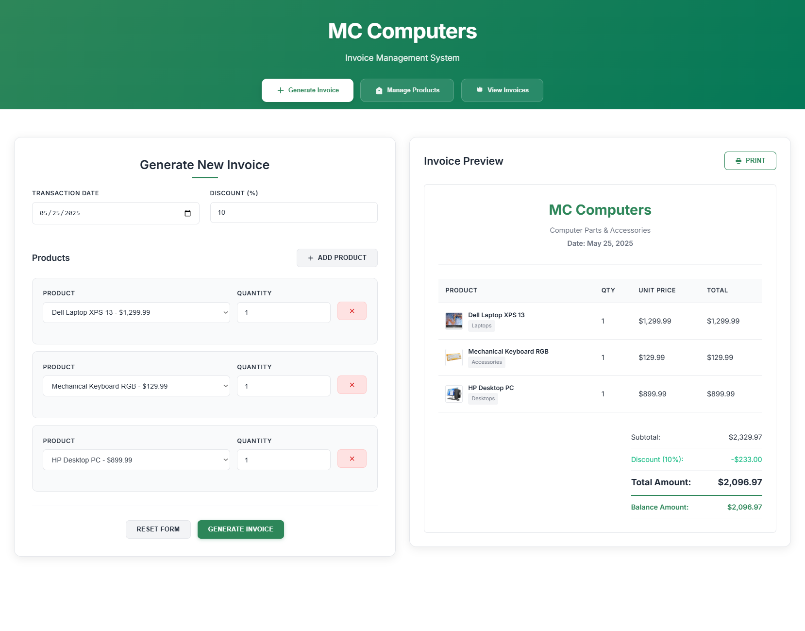

# MCComputers Frontend Application

MCComputers is a comprehensive computer retail management system built with Angular 17. This application provides a complete solution for managing computer products, generating invoices, and tracking sales for computer retail businesses.

## 🚀 Features

### Core Functionality
- **Product Management**: Add, edit, and manage computer products and accessories
- **Invoice Generation**: Create professional invoices with detailed product information
- **Invoice History**: View and manage all generated invoices with detailed tracking
- **Dashboard Overview**: Get insights into business performance and sales metrics

### Technical Features
- Modern Angular 17 application with standalone components
- Angular Material Design for consistent UI/UX
- Reactive forms for data input and validation
- Component-based architecture for maintainability
- TypeScript for type safety and better development experience

## 🛠️ Technology Stack

- **Frontend Framework**: Angular 17.3.0
- **UI Library**: Angular Material 17.3.0
- **Language**: TypeScript 5.4.2
- **Styling**: CSS with Angular Material theming
- **Build System**: Angular CLI 17.3.8
- **Testing**: Jasmine & Karma
- **Server-Side Rendering**: Angular SSR

## 📱 Application Screenshots

### 1. Dashboard Overview

*Main dashboard providing business insights and quick access to key features*

### 2. Product Management

*Comprehensive product management interface for adding and maintaining computer inventory*

### 3. Invoice Generation

*User-friendly invoice creation form with product selection and customer details*

### 4. Invoice History

*Complete listing of all generated invoices with search and filter capabilities*

### 5. Invoice Details View

*Detailed view of individual invoices with complete transaction information*

## 🏗️ Project Structure

```
src/
├── app/
│   ├── components/
│   │   ├── invoice-generator/     # Invoice creation functionality
│   │   ├── invoice-list/          # Invoice history and management
│   │   ├── navigation/            # Application navigation
│   │   └── product-management/    # Product CRUD operations
│   ├── models/                    # TypeScript interfaces and models
│   ├── services/                  # Business logic and API services
│   ├── app.component.*            # Root component
│   └── app.routes.ts              # Application routing configuration
└── assets/                        # Static assets
```

## 📋 Prerequisites

- Node.js (version 18 or higher)
- npm (comes with Node.js)
- Angular CLI (`npm install -g @angular/cli`)

## 🚀 Getting Started

### Installation

1. **Clone the repository**
   ```bash
   git clone <repository-url>
   cd MCComputers/frontend/MCComputersFrontend
   ```

2. **Install dependencies**
   ```bash
   npm install
   ```

3. **Start the development server**
   ```bash
   npm start
   # or
   ng serve MCComputersFrontend
   ```

4. **Navigate to the application**
   Open your browser and go to `http://localhost:4200/`

## 🛠️ Development

### Development Server
Run `ng serve` for a dev server. Navigate to `http://localhost:4200/`. The application will automatically reload if you change any of the source files.

### Code Scaffolding
Run `ng generate component component-name` to generate a new component. You can also use `ng generate directive|pipe|service|class|guard|interface|enum|module`.

### Build
Run `ng build` to build the project. The build artifacts will be stored in the `dist/` directory.

### Testing
- **Unit Tests**: Run `ng test` to execute the unit tests via [Karma](https://karma-runner.github.io)
- **End-to-End Tests**: Run `ng e2e` to execute the end-to-end tests via a platform of your choice

## 📊 Available Scripts

| Script | Description |
|--------|-------------|
| `npm start` | Start development server |
| `npm run build` | Build the application for production |
| `npm run watch` | Build and watch for changes |
| `npm test` | Run unit tests |
| `npm run serve:ssr:MCComputersFrontend` | Serve with Server-Side Rendering |

## 🎯 Key Components

### Invoice Generator
- Interactive form for creating new invoices
- Product selection with real-time pricing
- Customer information management
- PDF generation capabilities

### Product Management
- CRUD operations for computer products
- Category-based organization
- Price and inventory tracking
- Product image management

### Invoice History
- Comprehensive invoice listing
- Advanced search and filtering
- Status tracking (paid, pending, overdue)
- Export functionality

### Navigation
- Responsive navigation menu
- Role-based access control
- User-friendly interface
- Mobile-optimized design

## 🔧 Configuration

The application uses Angular's configuration system:

- **Development**: `src/environments/environment.ts`
- **Production**: `src/environments/environment.prod.ts`
- **Angular Config**: `angular.json`
- **TypeScript Config**: `tsconfig.json`

## 🤝 Contributing

1. Fork the repository
2. Create a feature branch (`git checkout -b feature/amazing-feature`)
3. Commit your changes (`git commit -m 'Add some amazing feature'`)
4. Push to the branch (`git push origin feature/amazing-feature`)
5. Open a Pull Request

## 📝 License

This project is licensed under the MIT License - see the LICENSE file for details.

## 📞 Support

For support and questions:
- Create an issue in the repository
- Contact the development team
- Check the documentation

## 🚀 Future Enhancements

- Advanced reporting and analytics
- Email integration for invoice delivery
- Multi-currency support
- Mobile application
- Integration with accounting systems
- Barcode scanning for products

---

**Built with ❤️ using Angular 17 and Angular Material**
